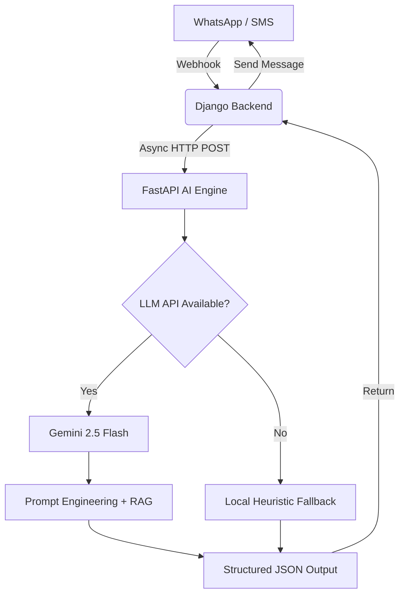

<div align="center">
  <h1>🐔 Agricare AI Engine</h1>
  <p><strong>A Multilingual, AI-Powered Veterinary Triage Assistant for Smallholder Poultry Farmers</strong></p>
  
  [](https://www.python.org/)
  [](https://fastapi.tiangolo.com/)
  [](https://deepmind.google/technologies/gemini/)
  [](https://huggingface.co/spaces)
</div>

---

## 📖 Overview

Agricare AI is an intelligent veterinary diagnostic engine designed specifically for smallholder poultry farmers in Sub-Saharan Africa. It utilizes **Google's Gemini 2.5 Flash API** coupled with a **Retrieval-Augmented Generation (RAG)** architecture to provide real-time, localized veterinary triage.

The engine does not guess—it is strictly prompted to act as a **Triage Assistant**. It asks clarifying questions if symptoms are vague, matches confirmed symptoms against a verified JSON knowledge base of poultry diseases, and outputs structured, multilingual advice.

---

## ✨ Core Features

* 🌍 **Native Multilingual NLP:** Understands and generates responses in **English, Hausa, Yoruba, Igbo, and Nigerian Pidgin**.
* 🛡️ **Safety-First Triage Logic:** Will explicitly ask 1-3 clarifying questions (age, duration, other symptoms) before making a diagnosis.
* ⚡ **Structured Output:** Forces the LLM to output predictable JSON (language, disease_id, urgency, escalation status) for easy backend parsing.
* 📴 **Offline Fallback:** Features a lightweight, heuristic keyword-matching engine that guarantees 100% uptime even if the upstream LLM API goes down.
* 🐳 **Dockerized Microservice:** Built on FastAPI, perfectly containerized for serverless deployment on platforms like Hugging Face Spaces.

---

## 🏗️ Architecture



---

## 🚀 API Documentation

The AI Engine exposes a single RESTful endpoint for inference.

### `POST /generateContent`

Analyzes user symptoms and returns a diagnostic triage JSON.

**Request Body:**
```json
{
  "query": "My chickens are 3 weeks old, they have twisted necks and green diarrhea."
}
```

**Response (Success):**
```json
{
  "language": "en",
  "disease_id": "newcastle",
  "disease_name": "Newcastle Disease",
  "urgency": "RED",
  "escalate": true,
  "answer": "This sounds like Newcastle Disease, which is highly contagious and fatal. Please isolate the sick birds immediately and contact a vet. You must vaccinate your remaining healthy birds."
}
```

**Response (Needs Context / Triage):**
```json
{
  "language": "en",
  "disease_id": null,
  "disease_name": null,
  "urgency": "GREEN",
  "escalate": false,
  "answer": "I am sorry your birds are sick. To help me understand, how old are they and how long have they been dizzy?"
}
```

---

## 🛠️ Local Development

### 1. Requirements
* Python 3.10+
* A Google Gemini API Key

### 2. Setup
Clone the repository and install dependencies:
```bash
cd agricare_ai
pip install -r requirements.txt
```

Set up your environment variables:
```bash
export GEMINI_API_KEY="your_api_key_here"
```

### 3. Run the Server
Start the FastAPI server locally:
```bash
uvicorn app:app --host 0.0.0.0 --port 8001 --reload
```

You can now test the engine at `http://localhost:8001/docs` (Swagger UI).

---

## ☁️ Deployment (Hugging Face Spaces)

This repository is pre-configured for deployment on **Hugging Face Spaces** using the Docker SDK.

1. Create a new Space on Hugging Face (SDK: Docker).
2. Set your `GEMINI_API_KEY` in the Space's settings (Secrets).
3. Push this directory to the Space using `git subtree`:
   ```bash
   git subtree push --prefix agricare_ai huggingface main
   ```

---
*Built with ❤️ for Nigerian Poultry Farmers.*
